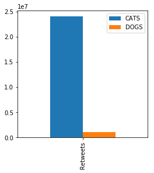

# Cat vs. Dog Neologisms on Twitter  
Margaret Jones (mmj32)  
Data Science for Linguists  
14 December 2017  

## Table of Contents
- [Introduction](#introduction)  
- [Background Information](#background)  
- [Data Sourcing](#data-sourcing)
- [Data Cleanup](#data-cleanup)
- [Analysis](#analysis)
- [Conclusion](#conclusion)  

## Introduction
For this project I was inspired by one of the homework assignments we had in our Data Science for Linguists class, as well as my own interests in cat and dog neologisms. In order to compare them, I decided to look at their popularity on a huge social media platform: Twitter.   

## Background  
Twitter first started in 2006, but has really grown in popularity since then. In 2011, it really took off and can continued to get bigger ever since. Like many other social media platforms, it allows users to post their own content and display it publicly online. You can search for posts of a related theme by using hashtags.   
In the more recent years (in the time of the original grumpy cat and doge), people have begun to create a bunch of new words in reference to specific things. Dogs and cats, however, seem to have an ever increasing number of neologisms all sparking from an internet meme in the given category. (Cat - grumpy cat; Dog - doge)

## Data Sourcing  
In order to get the data necessary, I had to scrape Twitter using tweepy to connect to the twitter API and then search by the specific hashtags I desired. Tweepy was a really nice tool and makes things incredibly easy to clean, so this worked out very well. The only trouble here is that you cannot just go and scrape all of the dog related tweets or cat related tweets. The twitter API is picky about how many tweets it will let you take and any given time. So you have to gather your data over the span of several weeks to months and be sure to collect at a bunch of different times of the day. You also have to be extremely careful with how you store the data from this. For example, you're no allowed to store the actual tweet itself, only information about it (like the tweet ID). Which means if you want to look up a tweet later, you have to do it individually with a function by tweet ID (so not impossible just time consuming).

## Data Cleanup  
As previously stated, clean up was rather easy. All that was needed was a function to store all of the savable information into a DataFrame.

## Analysis  
The analysis of this project was very fun. To start, I wanted to figure out how I was going to gage popularity, so I decided to do both retweets and favorites. I fully expected to get similar numbers for both, but that was not the case at all.  

In fact, this turned out to be a very interesting comparison because often times cats would be higher in retweets but lower in favorites or vice versa. Watching the two go back and forth throughout the data collection process was very interesting. (I wish I had saved graphs form previous time to compare but I didn't so here are the most recent)  
#### Favorites  
  
  

#### Retweets  
  
  

Then I moved on to trying to figure out where exactly all of these popular tweets were coming from. Considering they are English Neologisms, I expected to find them coming from majorly English speaking countries, but that wasn't the case, which was a very interesting find. Also, look at how well-spread the neologisms were in different areas. Cat neologisms seem to be the most generally spread while dogs have lots of popularity in specific places.
[Find the code for this here.](Jupyter-Notebooks/Doggos-vs-Kittehs.md#moving-on-to-timezone)

Finally, I moved on to comparing which neologisms were the most commonly used. The numbers for #cat were so much higher than all the others i ended up needing to split the pie carts up several times to really come to any sort of conclusion.  

#### STARTING WITH RETWEETS  
The intense popularity of #cat  
  
Without #cat  
  
Just dogs  
  
Just cats (without #cat)  
  

#### NOW FOR FAVOTIRES  
All together  
  
Just cats  
  
Just dogs  
  

## Conclusion  
After this experiment, I conclude that cat neologisms are just as popular as dog neologisms. Because the data is really dependent on current trends at the time of collection, the data would often drastically change without warning. Further research is necessary to come out with anything really conclusive because working with live data is difficult, and fluid and always changing, just like language.
